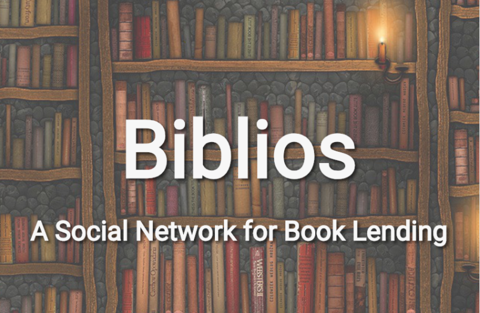

---

title: biblios

layout: ~/layouts/Default.vue

---

#### {{ $frontmatter.title }}

In January 2017, two of my friends and I competed in MIT's 6.148 Web Programming Competition (now called web.lab). We were named semifinalists for our web app, Biblios, which is a social network for book lending. On Biblios, users can log all the books they own and organize them however they'd like on various shelves. Users can also search for a book, find nearby users who own copies, and message those owners to arrange a loan.

You can check out Biblios [here](http://http://mit-biblios.herokuapp.com/).
